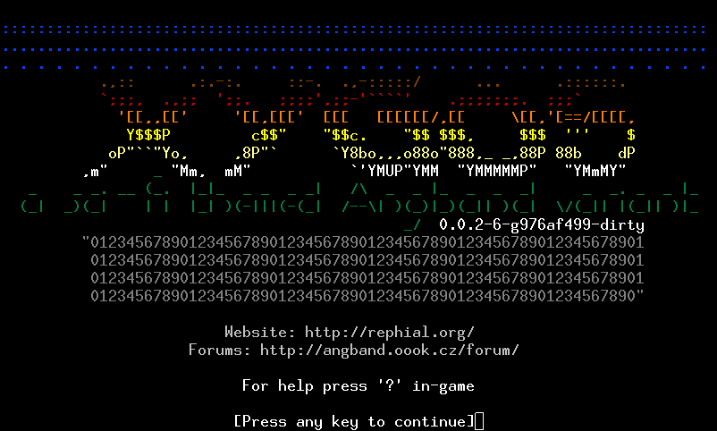

# Xygos 0.0.2

  
  

Xygos is a variant of Angband - a graphical dungeon adventure game that uses
textual characters to represent the walls and floors of a dungeon and the
inhabitants therein, in the vein of games like NetHack and Rogue.
If you need help in-game, press `?`.

- **Installing Xygos:** [compile it yourself - see this Angband documentation](https://angband.readthedocs.io/en/latest/hacking/compiling.html).
	- [but get the source from here](https://github.com/msearle5/angband)
- **How to Play:** [The Angband Manual](https://angband.readthedocs.io/en/latest/)
- **Getting Help:** [Angband Forums](http://angband.oook.cz/forum/)

Enjoy!

-- The Angband Dev Team
